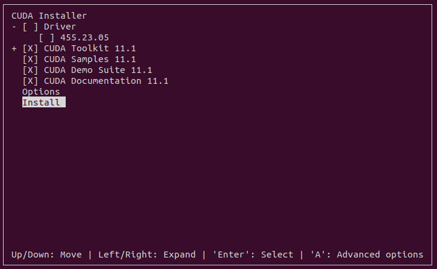

# Installation Guide

<!--  -->

## Table of Contents

- [Ubuntu](#ubuntu)
- [Nvidia Driver](#nvidia-driver)
- [CUDA](#cuda)
- [Python Env](#python-env)
- [Olympe](#olympe)
- [Sphinx](#sphinx)
- [ROS Noetic](#ros-noetic)
- [Python Requirements](#python-requirements)


Please follow the following instructions carefully for setting up your development environment properly. If there are any issues with installations or the codes, simply open a new issue request on the  [github repo](https://github.com/amir-ebram/deep_ros).


## Ubuntu

Install Ubuntu 20.04 dekstop image. Follow instructions on [ubuntu.com](https://releases.ubuntu.com/focal/). You can install it as dual-boot along your Windows but you can't use VM Ware as the GPU is inaccessible over virtual machine.

## Nvidia Driver

After installing Ubuntu, go ahead with installing the graphic card driver:

```
sudo apt-get install nvidia-driver-530
```

Reboot and verify the installation by:

```
sudo reboot 
nvidia-smi
```

## CUDA

We'll use CUDA 11.1 for this project. Download the runfile and install it. Remember to uncheck the Nvidia Driver on runfile:


```
cd ~/Downloads

wget https://developer.download.nvidia.com/compute/cuda/11.1.0/local_installers/cuda_11.1.0_455.23.05_linux.run
sudo sh cuda_11.1.0_455.23.05_linux.run
```




You need to add cuda path to your .bashrc after installation. Simply:

```
echo 'export PATH="/usr/local/cuda-11.1/bin:$PATH"' >> ~/.bashrc
echo 'export LD_LIBRARY_PATH="/usr/local/cuda-11.1/lib64:$LD_LIBRARY_PATH"' >> ~/.bashrc
```

Now you can check your CUDA version:

```
source ~/.bashrc
nvcc --version
```


## Python Env

First things first, you need to change teh default python command:

```
sudo apt install python-is-python3
```

Type python on terminal and double check the default python env which should be 3.8:

```
python
```


Before installing Parrot Olympe and other Python pacakges, it's needed to setup a virtual Python environment (let's call it parrot) for using a newer version of pip (20.3 or higher).

```
python -m venv parrot
source parrot/bin/activate
```

You'll see an indicator (parrot) on your terminal. Now you need to upgrade your pip on parrot env:

```
python -m pip install --upgrade pip
```

Double check you pip version, it should be 23.3:

```
pip --version
```

## Olympe


Now it's time or Olympe, make sure you're installing it on parrot env:

```
pip install parrot-olympe
```

Double check installation by importing it on parrot:

```
python
>>> import olympe
>>> quit()
```


## Sphinx

For simulating a drone and sending commands, we need to Parrot Sphinx simulator which is based on UE4 (Unreal Engine). 


```
curl --fail --silent --show-error --location https://debian.parrot.com/gpg | gpg --dearmor | sudo tee /usr/share/keyrings/debian.parrot.com.gpg > /dev/null
echo "deb [signed-by=/usr/share/keyrings/debian.parrot.com.gpg] https://debian.parrot.com/ $(lsb_release -cs) main generic" | sudo tee /etc/apt/sources.list.d/debian.parrot.com.list
sudo apt update
```

```
sudo apt install parrot-sphinx
```


Now it's time to install Parrot UE4:

```
sudo apt update
sudo apt install parrot-ue4-empty
```

## ROS Noetic

ROS or Robot Operating System is a middleware which allows developing roboitcs packages and runtimes. The greatest advantage of ROS is that it comes with predeveloped pipelines for establshing communication between different Python and C++ nodes. To install ROS simply follow the instructions below:


Configure Ubuntu repositories:


```
sudo sh -c 'echo "deb http://packages.ros.org/ros/ubuntu $(lsb_release -sc) main" > /etc/apt/sources.list.d/ros-latest.list'
sudo apt install curl # if you haven't already installed curl
curl -s https://raw.githubusercontent.com/ros/rosdistro/master/ros.asc | sudo apt-key add -
```

Installation:

```
sudo apt update
sudo apt install ros-noetic-desktop-full
source /opt/ros/noetic/setup.bash
```

Rosdep:

```
sudo apt install python3-rosdep python3-rosinstall python3-rosinstall-generator python3-wstool build-essential
sudo apt install python3-rosdep
sudo rosdep init
rosdep update
```

Verifying installation:

```
printenv | grep ROS
source /opt/ros/noetic/setup.bash
```

Catkin workspace setup:

```
$ mkdir -p ~/catkin_ws/src
$ cd ~/catkin_ws/
$ catkin_make

```


Before running the next command, replace {user} with your own Ubuntu username:


```
echo 'source /home/{user}/catkin_ws/devel/setup.bash' >> ~/.bashrc
source ~/.bashrc
```


Now simply run roscore in a terminal to run ROS:

```
roscore
```

## Python Requirements

```
pip install -r requirements.txt
```

